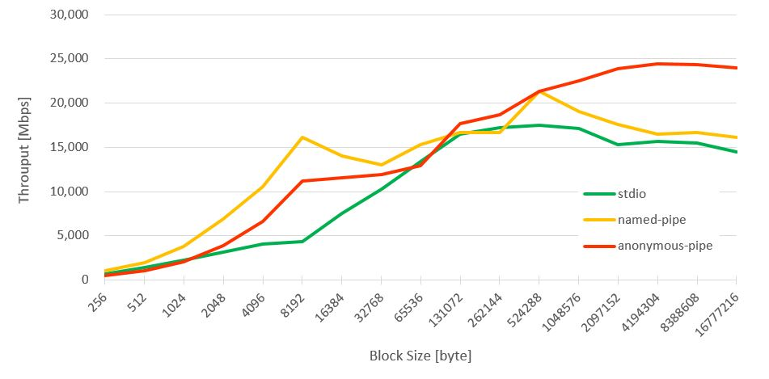
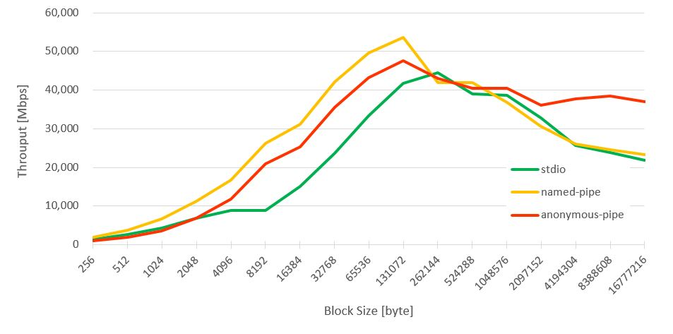
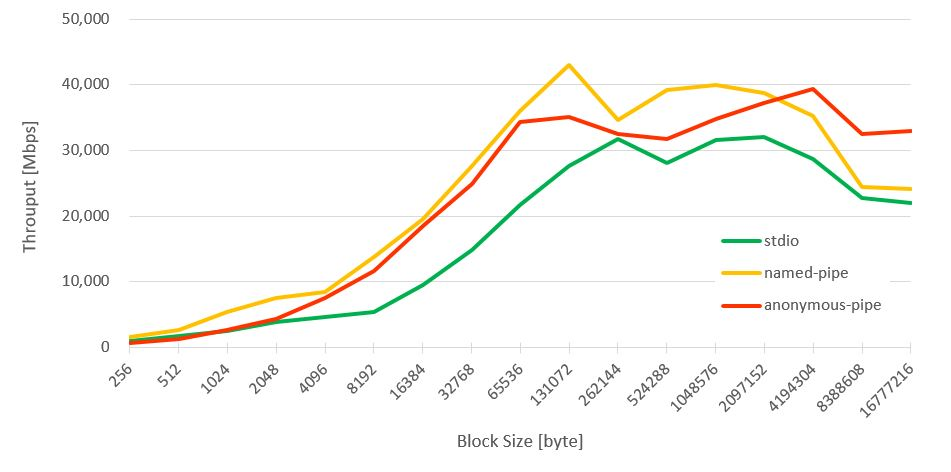

# StdioThrouputTest

## Evaluation Environment

|Key|Value|
|--|--|
|No. of chain|1|
|Data size (Byte)|1,073,741,824|
|Average of |5|

## Results

### No. 1

|Key|Value|
|--|--|
|Architecture|x86 64|
|CPU mode|64-bit|
|Byte Order|Little Endian|
|No. of CPUs|2|
|Thread(s) per core|2|
|CPU Frequency|2600 MHz|
|L1d, L1i cache|2 x 32 KB|
|L2 cache|2 x 256 KB|
|L3 cache|4 MB|
|RAM|16GB|
|RAM Frequency|1866 MHz|

### No. 2

|Key|Value|
|--|--|
|Architecture|x86 64|
|CPU mode|64-bit|
|Byte Order|Little Endian|
|No. of CPUs|4|
|Thread(s) per core|2|
|CPU Frequency|4000 MHz|
|L1d, L1i cache|4 x 32 KB|
|L2 cache|4 x 256 KB|
|L3 cache|8 MB|
|RAM|32GB|
|RAM Frequency|2400 MHz|

### No. 3

|Key|Value|
|--|--|
|Architecture|x86 64|
|CPU mode|64-bit|
|Byte Order|Little Endian|
|No. of CPUs|4|
|Thread(s) per core|2|
|CPU Frequency|2700 MHz|
|L1d, L1i cache|4 x 32 KB|
|L2 cache|4 x 256 KB|
|L3 cache|8 MB|
|RAM|64GB|
|RAM Frequency|2134 MHz|

## Refferences
[Evaluation of Inter-Process Communication Mechanisms](http://pages.cs.wisc.edu/~adityav/Evaluation_of_Inter_Process_Communication_Mechanisms.pdf)