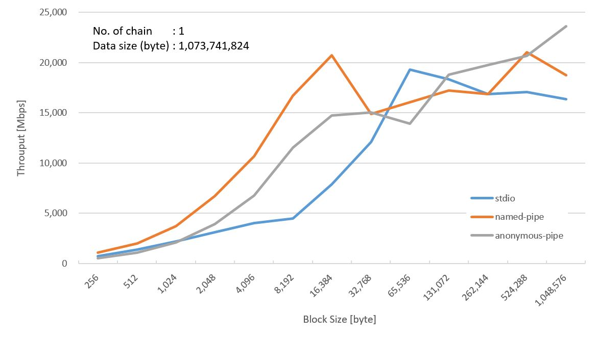

# StdioThrouputTest

## Evaluation Environment

|Key|Value|
|--|--|
|Architecture|x86 64|
|CPU mode|64-bit|
|Byte Order|Little Endian|
|No. of CPUs|2|
|Thread(s) per core|2|
|CPU Frequency|2600 MHz|
|L1d, L1i cache|2 x 32 KB|
|L2 cache|256 KB|
|L3 cache|4 MB|

## Results

## Refferences
[Evaluation of Inter-Process Communication Mechanisms](http://pages.cs.wisc.edu/~adityav/Evaluation_of_Inter_Process_Communication_Mechanisms.pdf)